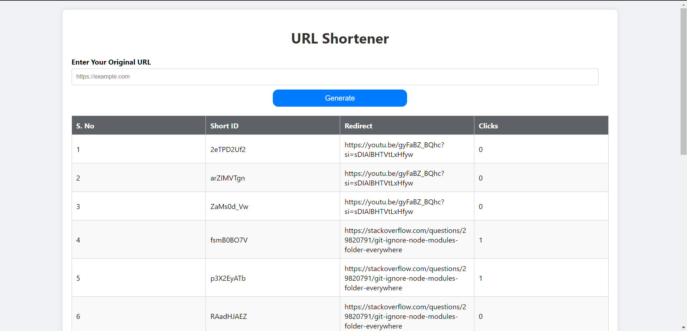

# URL Shortener Application

This application is a simple URL shortener built with Node.js, Express, MongoDB, and EJS for templating. It allows users to enter a URL to be shortened and provides a simplified link that redirects to the original URL. Additionally, it tracks the number of times each shortened URL is accessed.

## Features

- URL shortening: Users can submit a URL to receive a shortened version.
- Access tracking: The application tracks how many times each shortened URL is accessed.
- Responsive design: The application is styled to be responsive, making it accessible on various devices.

## Technologies Used

- **Node.js**: A JavaScript runtime built on Chrome's V8 JavaScript engine.
- **Express**: A minimal and flexible Node.js web application framework.
- **MongoDB**: A NoSQL database for storing URL mappings and access counts.
- **EJS**: A templating language to generate HTML markup with plain JavaScript.
- **CSS**: For styling the application.

## Setup and Installation

1. **Clone the repository**
   ```bash
   git clone <repository-url>
2. **Navigate to the project directory**

   ```bash
   cd <project-directory>
3. **Install dependencies**

   ```bash
   npm install 
4. **Connect to MongoDB**
   Ensure MongoDB is installed and running on your system. Update the connection string in the connectToMongoDB function if necessary
   
5. **CStart the application**

   ```bash
   npm start

The server will start running on http://localhost:8000.

## Usage
## Creating a Shortened URL

Navigate to `http://localhost:8000` and enter the URL you wish to shorten in the provided form. Upon submission, the application will display the shortened URL.

## Accessing a Shortened URL

Use the shortened URL provided by the application in any web browser. The application will redirect you to the original URL and increment the access count.





## Contributing

Contributions to the project are welcome. Please follow the standard fork and pull request workflow.

## License

This project is licensed under the MIT License - see the LICENSE file for details.